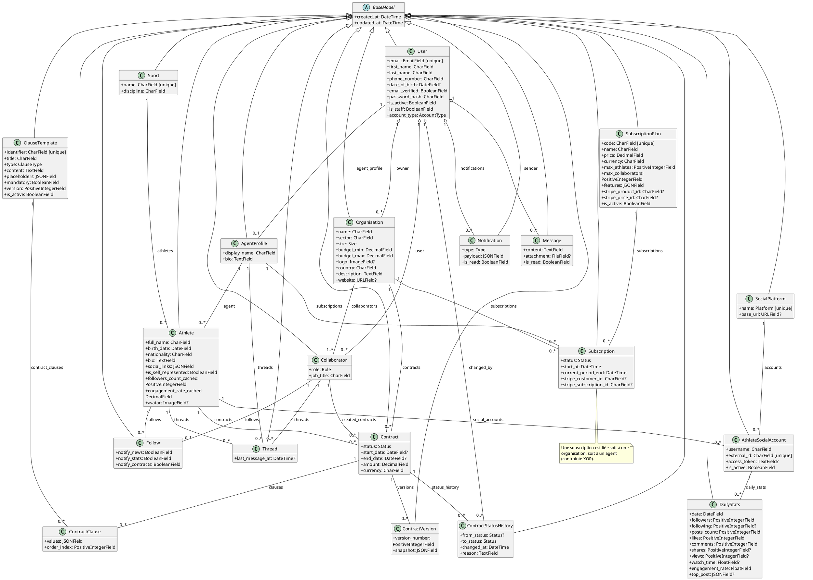

# Diagramme UML de la base de données

Ce diagramme UML détaille l'intégralité du modèle relationnel du backend. Il comprend les attributs principaux de chaque entité ainsi que les cardinalités entre elles. Les attributs hérités de `BaseModel` (identifiant UUID et métadonnées temporelles) sont indiqués une seule fois pour alléger la lecture.

> 💡 **Astuce :** pour visualiser le diagramme, copiez le bloc PlantUML ci-dessus dans un rendu compatible (PlantUML, Kroki, etc.).
