# Database UML Diagram

This schema covers every persisted Django model for the Sponsors Club application. It includes cardinalities, primary fields, and association tables.

```mermaid
classDiagram
    direction TB

    class User {
        +UUID id
        +datetime created_at
        +datetime updated_at
        +email email (unique)
        +string first_name
        +string last_name
        +string phone_country_code?
        +string phone_number?
        +date date_of_birth?
        +bool email_verified
        +string password_hash
        +bool is_active
        +bool is_staff
        +string account_type
        +string password
        +datetime last_login?
        +bool is_superuser
    }

    class AgentProfile {
        +UUID id
        +datetime created_at
        +datetime updated_at
        +text bio
        +bool is_self_represented
    }

    class EmailVerificationToken {
        +UUID id
        +datetime created_at
        +datetime updated_at
        +char token_hash
        +datetime expires_at
        +datetime used_at?
    }

    class Organisation {
        +UUID id
        +datetime created_at
        +datetime updated_at
        +string name
        +slug slug (unique)
        +string type
        +string industry
        +image logo?
        +image banner_image?
        +text description
        +url website_url
        +email email_contact
        +string phone_contact
        +string address_city
        +string address_country
        +string address_postal_code
        +json social_links
        +int founded_year?
        +int employees_count?
        +string budget_range
        +json sponsoring_focus
    }

    class Collaborator {
        +UUID id
        +datetime created_at
        +datetime updated_at
        +string role
        +string job_title
    }

    class OrganisationInvite {
        +UUID id
        +datetime created_at
        +datetime updated_at
        +string code (unique)
        +datetime expires_at
        +bool is_used
        +datetime used_at?
    }

    class Sport {
        +UUID id
        +datetime created_at
        +datetime updated_at
        +string name (unique)
        +slug slug (unique)
        +string emoji?
        +string category
    }

    class SportDiscipline {
        +UUID id
        +datetime created_at
        +datetime updated_at
        +string name
        +slug slug
        +string description
        +bool is_olympic
    }

    class Athlete {
        +UUID id
        +datetime created_at
        +datetime updated_at
        +string full_name
        +slug slug (unique)
        +date birth_date
        +string nationality
        +string country
        +string city
        +text bio
        +json social_links
        +int followers_count_cached
        +decimal engagement_rate_cached
        +image avatar?
    }

    class AthleteDiscipline {
        +UUID id
        +datetime created_at
        +datetime updated_at
    }

    class AthletePhoto {
        +UUID id
        +datetime created_at
        +datetime updated_at
        +image image
        +string caption
        +int position
    }

    class SocialPlatform {
        +UUID id
        +datetime created_at
        +datetime updated_at
        +string name (unique)
        +url base_url?
    }

    class AthleteSocialAccount {
        +UUID id
        +datetime created_at
        +datetime updated_at
        +string username
        +string external_id (unique)
        +text access_token?
        +bool is_active
    }

    class DailyStats {
        +UUID id
        +datetime created_at
        +datetime updated_at
        +date date
        +int followers
        +int following?
        +int posts_count
        +int likes
        +int comments
        +int shares?
        +int views?
        +float watch_time?
        +float engagement_rate
        +json top_post?
    }

    class Follow {
        +UUID id
        +datetime created_at
        +datetime updated_at
        +bool notify_news
        +bool notify_stats
        +bool notify_contracts
    }

    class SubscriptionPlan {
        +UUID id
        +datetime created_at
        +datetime updated_at
        +string code (unique)
        +string name
        +decimal price
        +string currency
        +int max_athletes
        +int max_collaborators
        +json features
        +string stripe_product_id
        +string stripe_price_id
        +bool is_active
    }

    class Subscription {
        +UUID id
        +datetime created_at
        +datetime updated_at
        +string status
        +datetime start_at
        +datetime current_period_end
        +string stripe_customer_id
        +string stripe_subscription_id
    }

    class Thread {
        +UUID id
        +datetime created_at
        +datetime updated_at
        +datetime last_message_at?
    }

    class Message {
        +UUID id
        +datetime created_at
        +datetime updated_at
        +text content
        +file attachment?
        +bool is_read
    }

    class Notification {
        +UUID id
        +datetime created_at
        +datetime updated_at
        +string type
        +json payload
        +bool is_read
    }

    class ClauseTemplate {
        +UUID id
        +datetime created_at
        +datetime updated_at
        +string category
        +string title
        +text content
        +json placeholders
        +bool is_mandatory
        +int version
    }

    class Contract {
        +UUID id
        +datetime created_at
        +datetime updated_at
        +string status
        +string title
        +date effective_date?
        +date expiration_date?
        +datetime owner_agreed_at?
        +datetime agent_agreed_at?
        +int current_version_number
    }

    class ContractClause {
        +UUID id
        +datetime created_at
        +datetime updated_at
        +string title
        +text content
        +bool is_mandatory
        +bool is_modified
    }

    class ContractRevision {
        +UUID id
        +datetime created_at
        +datetime updated_at
        +text comment
        +bool accepted?
    }

    class ContractVersion {
        +UUID id
        +datetime created_at
        +datetime updated_at
        +int number
        +text notes
    }

    class ContractComment {
        +UUID id
        +datetime created_at
        +datetime updated_at
        +text body
    }

    class ContractLegalReview {
        +UUID id
        +datetime created_at
        +datetime updated_at
        +text notes
        +datetime verified_at?
        +text verification_notes
    }

    class ContractSigning {
        +UUID id
        +datetime created_at
        +datetime updated_at
        +string envelope_id
        +string status
        +json last_payload
        +datetime completed_at?
    }

    class ContractFile {
        +UUID id
        +datetime created_at
        +datetime updated_at
        +file pdf
    }

    User "1" -- "0..1" AgentProfile : agent_profile
    User "1" -- "0..*" EmailVerificationToken : email_tokens
    User "1" -- "0..*" Collaborator : user
    User "0..1" -- "0..*" OrganisationInvite : used_by
    User "1" -- "0..*" Message : sender
    User "1" -- "0..*" Notification : notifications
    User "1" -- "0..*" ContractRevision : proposed_by
    User "1" -- "0..*" ContractVersion : created_by
    User "1" -- "0..*" ContractComment : author
    User "1" -- "0..*" ContractLegalReview : requested_by
    User "0..1" -- "0..*" ContractLegalReview : verified_by
    User "1" -- "0..*" ContractSigning : initiated_by

    Organisation "1" -- "0..*" Collaborator : collaborators
    Organisation "0..1" -- "1" Collaborator : owner
    Organisation "1" -- "0..*" OrganisationInvite : invites
    Organisation "1" -- "0..*" Contract : contracts
    Organisation "0..1" -- "0..*" Subscription : subscriptions

    Collaborator "1" -- "0..*" OrganisationInvite : created_invites
    Collaborator "1" -- "0..*" Follow : follows
    Collaborator "1" -- "0..*" Thread : threads
    Collaborator "0..1" -- "0..*" Contract : initiated_contracts

    AgentProfile "1" -- "0..*" Athlete : athletes
    AgentProfile "1" -- "0..*" Thread : threads
    AgentProfile "1" -- "0..*" Contract : contracts
    AgentProfile "0..1" -- "0..*" Subscription : subscriptions

    Sport "1" -- "0..*" SportDiscipline : disciplines
    Sport "1" -- "0..*" Athlete : athletes

    SportDiscipline "1" -- "0..*" AthleteDiscipline : discipline_links
    Athlete "1" -- "0..*" AthleteDiscipline : discipline_links
    Athlete "1" -- "0..*" AthletePhoto : photos
    Athlete "1" -- "0..*" AthleteSocialAccount : social_accounts
    Athlete "1" -- "0..*" Follow : follows
    Athlete "0..1" -- "0..*" Thread : threads

    AthleteDiscipline "0..*" -- "1" SportDiscipline : discipline
    AthleteDiscipline "0..*" -- "1" Athlete : athlete

    SocialPlatform "1" -- "0..*" AthleteSocialAccount : accounts
    AthleteSocialAccount "1" -- "0..*" DailyStats : daily_stats

    SubscriptionPlan "1" -- "0..*" Subscription : subscriptions

    Thread "1" -- "0..*" Message : messages
    Thread "0..*" -- "0..1" Athlete : athlete

    Contract "1" -- "0..*" ContractClause : clauses
    Contract "1" -- "0..*" ContractRevision : revisions
    Contract "1" -- "0..*" ContractVersion : versions
    Contract "1" -- "0..*" ContractComment : comments
    Contract "1" -- "0..1" ContractLegalReview : legal_review
    Contract "1" -- "0..1" ContractSigning : signing
    Contract "1" -- "0..1" ContractFile : file

    ContractClause "0..*" -- "0..*" ContractRevision : clauses_changed
    ContractClause "0..1" -- "0..*" ContractComment : comments

    ContractRevision "0..1" -- "0..*" ContractVersion : resulting_versions

    ContractVersion "1" -- "0..*" ContractComment : comments
    ContractVersion "0..*" -- "0..1" ContractRevision : source_revision
```

## Key considerations

- The models inherit from a shared base with UUID identifiers and automatic timestamps, simplifying replication across environments. 【F:users/models.py†L19-L28】【F:athletes/models.py†L14-L33】
- The `Subscription` model enforces an XOR constraint: a subscription is linked either to an organisation or to an agent, but never to both simultaneously. 【F:payments/models.py†L81-L124】
- `Organisation.owner` references the `Collaborator` representing the owner, so ownership and collaborator permissions always stay aligned (see `organisations/models.py`).
- Contract revisions maintain a many-to-many relationship to clauses via `clauses_changed`, allowing the product to track exactly which provisions were proposed and subsequently versioned. 【F:contracts/models.py†L123-L214】
- `User` inherits from `PermissionsMixin`, keeping Django's native relations with groups and permissions (`auth_group`, `auth_permission`); they are not detailed here but remain available in the database. 【F:users/models.py†L8-L18】
