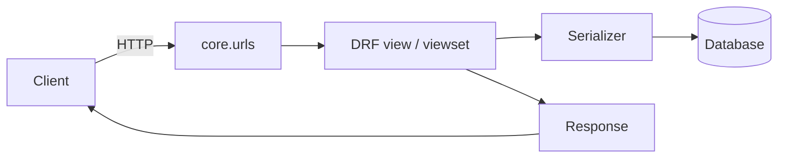

# Architecture Overview

This backend is a Django 4.2 monolith that exposes a JSON API through Django REST Framework (DRF). Domain logic is partitioned into dedicated Django apps that share cross-cutting services for authentication, subscriptions, and feature gating. The following sections outline how requests traverse the stack and where each capability lives.

## Platform topology

- **Frameworks** – Django handles routing, ORM, and the admin, while DRF provides API views, serializers, and authentication adapters including SimpleJWT for stateless access tokens. Session authentication is also enabled for admin or HTML proof-of-concept pages.
- **Core services** – The `core` app wires configuration, URL routing, and reusable permission helpers such as the feature entitlement evaluators.
- **Domain apps** – Business logic is grouped into apps for analytics, athletes, contracts, follows, messaging, notifications, payments, organisations, and users. Each app contributes its own models, serializers, and API views.

## Request flow at a glance

1. Requests enter through `core.urls`, which mounts each app under an `/api/` prefix (or `/api/<namespace>/` for scoped routers).
2. DRF class-based views enforce authentication/permissions, call serializers, and perform ORM queries.
3. Serializers shape the response payloads and apply validation before returning JSON to the client.

## Application map

| App | Responsibility highlights |
| --- | --- |
| `analytics` | Social account metrics, comparison, and sync tasks. |
| `athletes` | Athlete roster CRUD, sports metadata, and subscription quotas. |
| `contracts` | Contract templates, lifecycle statuses, and document rendering. |
| `follows` | Tracking marketplace follows with entitlement checks. |
| `messaging` | Threaded messaging with participant permissions and pagination. |
| `notifications` | In-app notification feed and read/unread state. |
| `payments` | Plans, subscriptions, and feature metadata powering entitlements. |
| `organisations` | Organisation records, collaborator management, and invitations. |
| `users` | Registration, authentication, profile management, roles, and entitlements. |

## Mounted routes

| URL prefix | Module | Notes |
| ---------- | ------ | ----- |
| `/admin/` | `django.contrib.admin` | Django admin for staff tooling. |
| `/accounts/` | `django.contrib.auth.urls` | Session-based auth endpoints for HTML flows. |
| `/api/users/` | `users.urls` | Registration, JWT endpoints, self-service profile, roles, entitlements. |
| `/api/` | `organisations.urls` | Organisation CRUD, collaborator management. |
| `/api/` | `athletes.urls` | Athlete management and roster queries. |
| `/api/` | `follows.urls` | Follow/unfollow marketplace entries. |
| `/api/messaging/` | `messaging.urls` | Thread/message APIs scoped under `/messaging/`. |
| `/api/` | `contracts.urls` | Contract workspace APIs. |
| `/api/` | `analytics.urls` | Analytics listings and comparison endpoints. |
| `/api/payments/` | `payments.urls` | Plan catalogue and subscription management. |
| `/api/notifications/` | `notifications.urls` | Notification feed. |
| `/poc/login/`, `/poc/messaging/` | `TemplateView` | HTML proof-of-concept pages wired to the API. |
| `/api/docs/`, `/api/redoc/`, `/api/schema/` | `drf_yasg` (optional) | Interactive API schema when `drf-yasg` is installed. |

These routes share middleware, settings, and deployment configuration defined in the `core` app. Each app keeps its tests colocated with the implementation for faster iteration.
